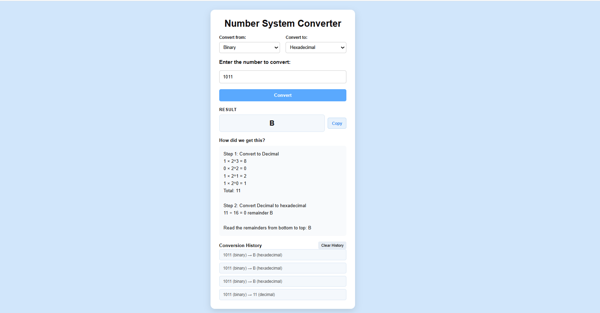
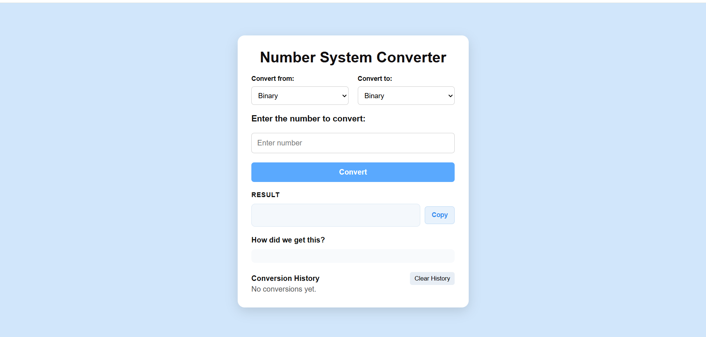

# Number System Converter

A frontend web application that converts numbers between Binary, Octal, Decimal, and Hexadecimal number systems.

The project implements the conversion logic using custom JavaScript algorithms and provides step-by-step explanations for understanding how each conversion is performed.

## Features

- Convert between Binary, Octal, Decimal, and Hexadecimal
- Custom number conversion algorithms
- Input validation based on the selected number system
- Step-by-step conversion explanations
- Copy converted results to clipboard
- Conversion history
- Clear conversion history
- Persistent history using Local Storage
- Enter key support for quick conversion
- Responsive design for mobile and desktop devices

## Technologies Used

- HTML5
- CSS3
- JavaScript
- Browser Local Storage API

## How It Works

The converter uses Decimal as an intermediate number system for cross-base conversions.

For example:

Binary -> Decimal -> Hexadecimal

This avoids creating separate conversion logic for every possible pair of number systems.

### Decimal to Binary, Octal, or Hexadecimal

The conversion uses the repeated division method:

1. Divide the decimal number by the target base.
2. Store the remainder.
3. Divide the quotient again.
4. Continue until the quotient becomes 0.
5. Read the remainders from bottom to top.

For hexadecimal conversion, remainders from 10 to 15 are mapped to:
10 → A
11 → B
12 → C
13 → D
14 → E
15 → F

### Binary, Octal, or Hexadecimal to Decimal

The converter uses positional notation to convert values into Decimal.
Each digit is multiplied by the corresponding power of its base, and the resulting values are added together.

For example:
(1010)2

= 1 × 2³
+ 0 × 2²
+ 1 × 2¹
+ 0 × 2⁰

= (10)10
### Cross-Base Conversion

For conversions such as Binary → Hexadecimal, the converter uses Decimal as an intermediate step:

Binary -> Decimal -> Hexadecimal

## Project Structure
number-system-converter/
-index.html        # Main webpage structure
-style.css         # Styling and responsive layout
-converter.js      # Conversion logic and application functionality
-screenshots/
  -main-conversion.png
  -main-interface.png
 README.md         # Project documentation

 ## Project Preview

